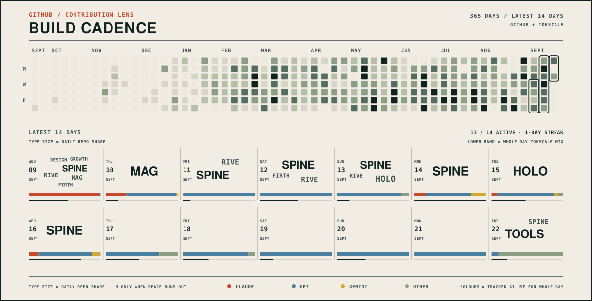

<picture>
  <source media="(max-width: 640px)" srcset="assets/profile-header-mobile.svg" />
  
</picture>

  
  
  
  

I helped build and operate an uncrewed survey vessel, then a regional remote operations service at Fugro. The projects below test how AI tools understand a codebase, remember past work, act within limits and check visual or physical output.

<picture>
  <source media="(max-width: 640px)" srcset="assets/system-map-mobile.svg" />
  
</picture>

## Projects

- [**Cairn**](https://cairn-framework.github.io/cairn/) keeps the plan for a codebase tied to the code and flags drift. ([source](https://github.com/cairn-framework/cairn))
- [**MAG**](https://george-rd.github.io/mag/) gives AI tools one private, local memory. ([source](https://github.com/George-RD/mag))
- [**OpenSpine**](https://george-rd.github.io/openspine/) limits what an AI agent may access and change. ([source](https://github.com/George-RD/openspine))
- [**Rive CLI**](https://george-rd.github.io/rive-rs-cli/) inspects, renders and tests Rive files from the command line. ([source](https://github.com/George-RD/rive-rs-cli))

## Activity

<picture>
  <source media="(max-width: 640px)" srcset="assets/contribution-lens-mobile.svg" />
  
</picture>

## More work

Tools: [Design Studio](https://george-rd.github.io/design-studio/) ([source](https://github.com/George-RD/design-studio)) · [Growth Arsenal](https://george-rd.github.io/growth-arsenal/) ([source](https://github.com/George-RD/growth-arsenal)) · [MeerK40t CLI](https://george-rd.github.io/cli-anything-meerk40t/) ([source](https://github.com/George-RD/cli-anything-meerk40t)) · [Hologlyph](https://george-rd.github.io/hologlyph/) ([source](https://github.com/George-RD/hologlyph))

Products: [Yarnling](https://georgerd.com/#proof) · [ReavesHQ](https://www.reaveshq.com/) · [OG Mallow](https://ogmallow.com/)
